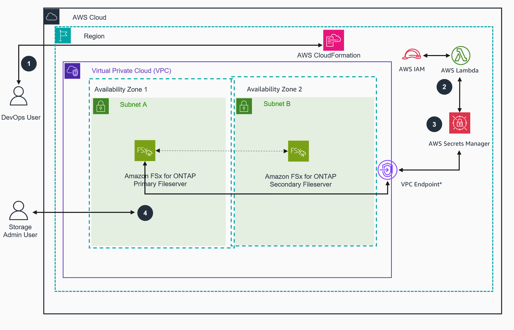
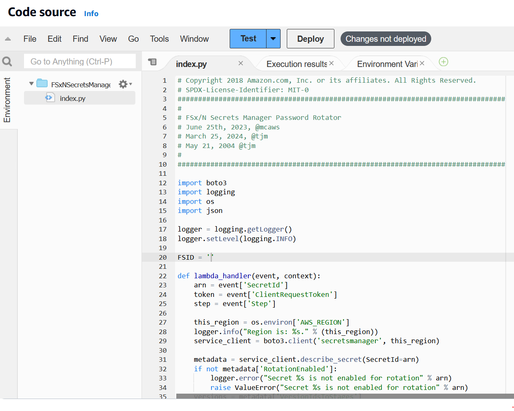
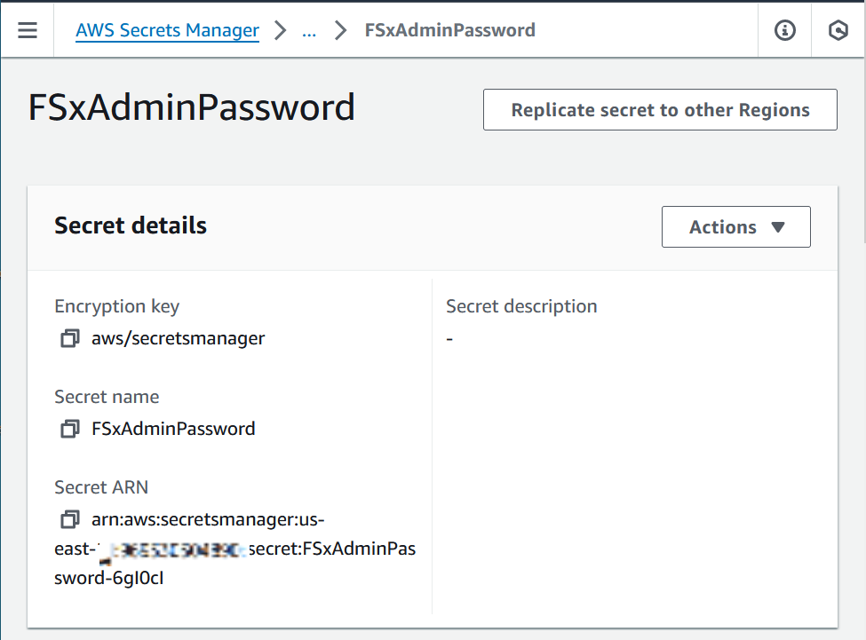
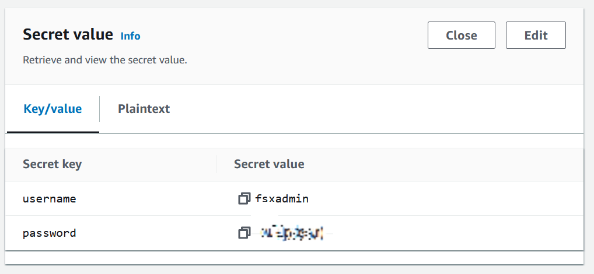
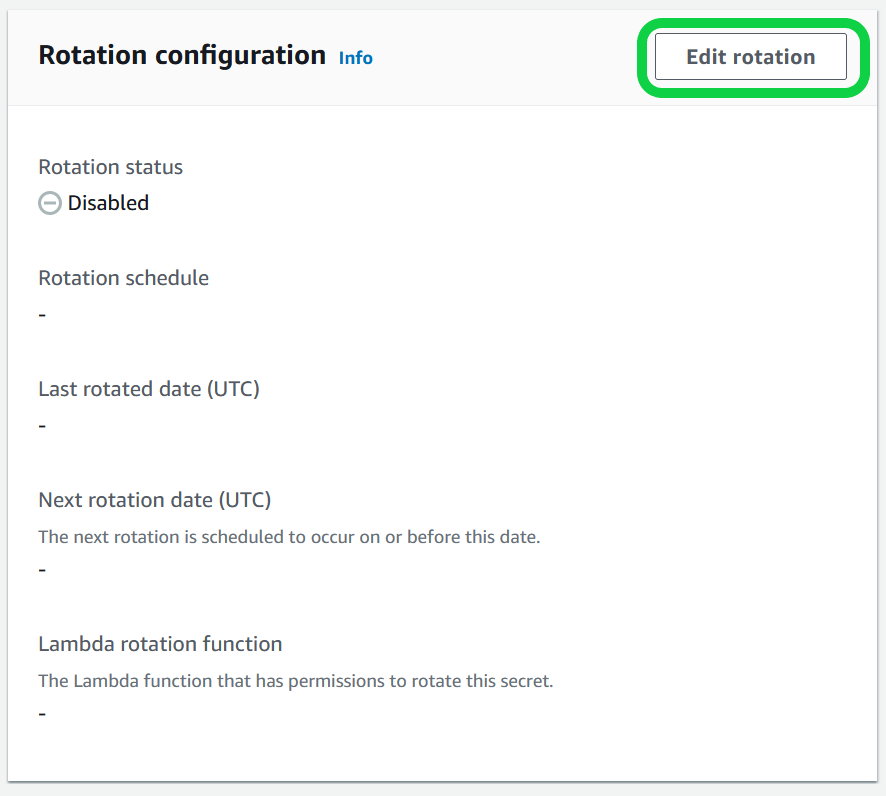
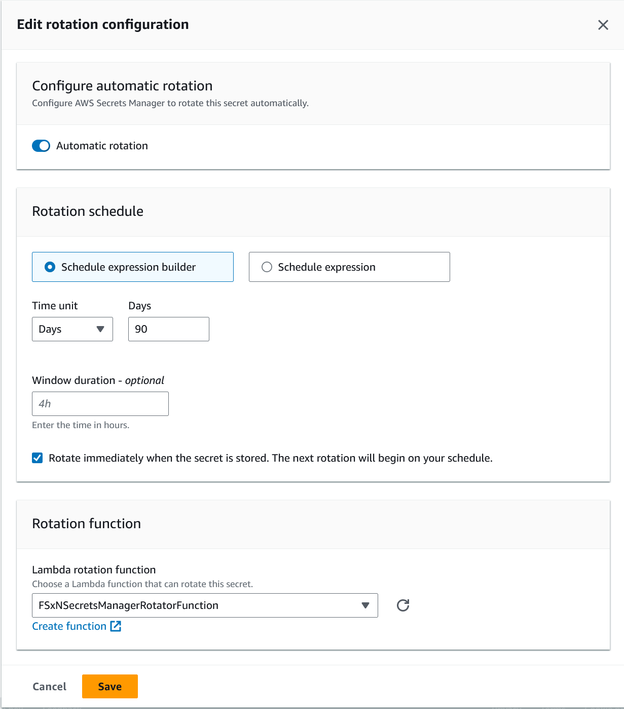
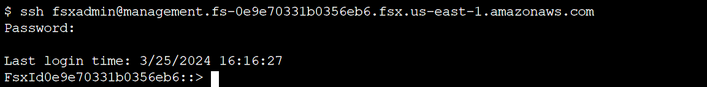

# Guidance for Automating FSx for NetApp ONTAP Password rotation with AWS Lambda and AWS Secrets Manager

## Table of Contents
1. [Introduction](#introduction)
2. [Solution Overview](#solution-overview)
3. [Costs](#costs)
4. [Deployment options](#deployment-options)
5. [Deployment steps](#deployment-steps)
6. [Post deployment steps](#post-deployment-steps)
7. [Undeployment steps](#undeployment-steps) 
8. [Customer responsibility](#customer-responsibility)
9. [Feedback](#feedback)
10. [Notices](#notices)

---

<a name="introduction"></a>
## Introduction

This user guide is created for anyone who is interested in automated rotation of the [AWS FSx for NetApp ONTAP file system](https://aws.amazon.com/fsx/netapp-ontap/) fsxadmin User. Automating the process of password rotation is important to help ensure data security. This README explains how to use [AWS Lambda](https://aws.amazon.com/lambda/) and [AWS Secrets Manager](https://aws.amazon.com/secrets-manager/) to automate password rotation for Amazon FSx for NetApp ONTAP file system administrators. The default FSx for ONTAP file system administrator is ‘fsxadmin’. This account manages the entire file system and its resources, sets up Storage Virtual Machines (SVMs), and delegates SVM administration to SVM administrators.

<a name="core-concepts"></a>
## Core Concepts
Below is a high-level overview of the Core Services that are incorporated into Automating the FSx for NetApp ONTAP password rotation. We will assume the reader is familiar with Git, Python, and AWS.

| Service | Description |
|---------|-------------|
| [AWS FSx for NetApp ONTAP file system](https://aws.amazon.com/fsx/netapp-ontap/) | Fully managed shared storage built on NetApp’s popular ONTAP file system. |
| [AWS Lambda](https://aws.amazon.com/lambda/) | Serverless compute service that runs code in response to events and automatically manages the compute resources, enabling developers to build applications that scale with business needs. |
| [AWS Secrets Manager](https://aws.amazon.com/secrets-manager/) | stores user credentials, including password, Identity Access Management (IAM) role mapping |
| [Amazon CloudWatch](https://aws.amazon.com/cloudwatch/) | Observe and monitor resources and applications on AWS. |
| [Amazon CloudTrail](https://aws.amazon.com/cloudtrail/) | Track user activity and API usage on AWS. |
| [Amazon Identity and Access Management](https://aws.amazon.com/aim/) | Securely manage identities and access to AWS services and resources |
| [AWS CloudFormation](https://aws.amazon.com/cloudformation/) | Speed up cloud provisioning with infrastructure as code |
---

<a name="solution-overview"></a>
## Solution Overview
AWS Lambda enables you to run code without provisioning or managing servers, creating workload-aware cluster scaling logic, maintaining event integrations, or managing runtimes. We'll deploy an AWS CloudFormation template that will create an Amazon IAM role and an AWS Lambda function, which will perform the password change. The pattern explained here also works for other administrative accounts, like ‘vsadmin’, which is used to manage SVMs. The AWS Lambda password policy from this post implements the following password characteristics based upon the GetRandomPassword API Call:

- A password length of sixteen characters.
- Randomly generated mix of uppercase, lowercase, numbers, and non-alphanumeric characters.

You can customize these parameters to meet your organization’s requirements for password length and complexity.

We then use AWS Secrets Manager password rotation services to automate password changes. Rotation is the process of periodically updating a secret. When you enable secret rotation, the credentials in the secret are automatically rotated by other AWS Services or AWS Lambda functions.

 

Figure 1. Automating Password Rotations for Amazon FSx For NetApp ONTAP

1. The DevOps user deploys the AWS CloudFormation Stack to the guidance. Using this infrastructure as code method, it would provision and configure all the necessary resources: [Amazon Identity and Access Management roles](https://aws.amazon.com/aim/), [AWS Lambda](https://aws.amazon.com/lambda/) function, [AWS Secrets Manager](https://aws.amazon.com/secrets-manager/) etc.

2. The DevOps user edits the parameter ‘FSID’ in the AWS Lambda function and populates the contents of the FSID parameter with target FSx for ONTAP file system ID. IAM roles and policies are used to restrict access of Lambda function to target AWS resources.

3. The DevOps user enables Secrets Manager Password Rotation in the AWS Secrets Manager Console, enables automatic password rotation and sets the time policy for rotation based on their organizational needs. After a few minutes, DevOps user goes back to the Secrets Manager console for and fetches the newly updated password value for FSxAdminPassword from Secrets Manager.

4. Using a system with access to the FSx for ONTAP filesystem, the Storage Administrator (Admin) user opens secure shell (SSH) to the cluster to verify that the fsxadmin account password is successfully rotated.

* NOTE: If the FSx for ONTAP file system is running in a private VPC rather than a public VPC, it’s recommended to create a [VPC endpoint](https://docs.aws.amazon.com/whitepapers/latest/aws-privatelink/what-are-vpc-endpoints.html) for Secrets Manager prior to launching the CloudFormation script. As file system architectural requirements vary from organization to organization, this was not included in the CloudFormation template.

The guidance encompasses several integrated components, with the AWS Secret's Manager rotation capability invoking the AWS Lambda function periodically. Logging and audit trails are available in Amazon CloudWatch and Amazon CloudTrail.

---

<a name="costs"></a>
## Costs and Licenses
While utilizing this guidance sample code doesn't incur any direct charges, please be aware that you will incur costs for the AWS services or resources activated by this guidance architecture. The cost for the [AWS FSx for NetApp ONTAP file system](https://aws.amazon.com/fsx/netapp-ontap/) is out side of the scope of this guidance. There is no direct charge to invoke the password change API for these file systems.
### Cost

You are responsible for the cost of the AWS services used while running this guidance. As of September 2024, the cost for running this guidance with the default settings in the US East-2 (Ohio) Region is approximately **\$ 3.40 per month**, assuming **10 password read attempts/downloaded per month**.

This guidance uses [Serverless services](https://aws.amazon.com/serverless/), which use a on-demand billing model - costs are incurred with usage of the deployed resources. Refer to the [Sample cost table](#sample-cost-table) for a service-by-service cost breakdown.

We recommend creating a [budget](https://alpha-docs-aws.amazon.com/awsaccountbilling/latest/aboutv2/budgets-create.html) through [AWS Cost Explorer](http://aws.amazon.com/aws-cost-management/aws-cost-explorer/) to help manage costs. Prices are subject to change. For full details, refer to the pricing webpage for each AWS service used in this guidance.

#### Sample cost table

The following table provides a sample cost breakdown for deploying this guidance with the default parameters in the `us-east-1` (US N. Virginia) Region for one month assuming "non-production" level volume of uploaded files.

| **AWS service**  | Dimensions | Cost \[USD\] |
|-----------|------------|---------|
| [AWS Lambda](https://aws.amazon.com/lambda/) | Invokes Password Change. | \$0.00 |
| [AWS Secrets Manager](https://aws.amazon.com/secrets-manager/) | stores user credentials, including password rotation. | \$0.40 |
| [Amazon CloudWatch](https://aws.amazon.com/cloudwatch/) | Observe and monitor resources and applications on AWS. | \$3.00 |
| [Amazon CloudTrail](https://aws.amazon.com/cloudtrail/) | Track user activity and API usage on AWS. | \$0.00 |
| [Amazon Identity and Access Management](https://aws.amazon.com/aim/) | Securely manage identities and access to AWS services and resources | \$0.00 | 
| [AWS CloudFormation](https://aws.amazon.com/cloudformation/) | Speed up cloud provisioning with infrastructure as code | \$0.00 |
|**Total estimated cost per month:**|  | **\$ 3.40 per file system** |

This detailed cost breakdown can be found in this [AWS Pricing Calculator estimate](https://calculator.aws/#/estimate?id=4b78d2f27e14a10c47230784e899050b4dc9b61e)

<a name="deployment-options"></a>
## Deployment Options

- Click on the following link for a Console Launch via  [](https://console.aws.amazon.com/cloudformation/home?region=us-east-1#/stacks/new?stackName=FSxAdminPasswordRotator&templateURL=https://awsstorageblogresources.s3.us-west-2.amazonaws.com/blog1343/AWSLambdaPasswordRotation.yaml)
- Launch via [AWS CloudShell](https://aws.amazon.com/cloudshell/)
---

<a name="deployment-steps"></a>
## AWS CloudShell Deployment Steps

1. **Clone sample code GitHub repository using the following command:**
```
$ git clone https://github.com/aws-samples/Automating-FSx-for-NetApp-ONTAP-password-rotation.git
Cloning into 'Automating-FSx-for-NetApp-ONTAP-password-rotation'...
remote: Enumerating objects: 29, done.
remote: Counting objects: 100% (29/29), done.
remote: Compressing objects: 100% (20/20), done.
remote: Total 29 (delta 10), reused 26 (delta 9), pack-reused 0 (from 0)
Receiving objects: 100% (29/29), 14.22 KiB | 2.84 MiB/s, done.
Resolving deltas: 100% (10/10), done.
```

2. **Change directory to the src subdirectory located at 'Automating-FSx-for-NetApp-ONTAP-password-rotation/src':**
```
cd Automating-FSx-for-NetApp-ONTAP-password-rotation/src
```

3. **Launch CloudFormation template from CLI:**
```
aws cloudformation create-stack --stack-name FSxNPasswordRotationLambda --template-body file://AWSLambdaPasswordRotation.yaml --capabilities CAPABILITY_NAMED_IAM
```

---
<a name="post-deployment-steps"></a>
## Post Deployment Steps

1. After creating the FSxNSecretsManagerRotatorFunction Lambda, you must edit one parameter. In Figure 2: the parameter FSID is on line 20 of the Lambda in the parameter FSID. Populate the contents of the FSID parameter with your file system ID to be rotated. Then select Deploy to save the changes.


Figure 2: Editing the FSID parameter

Moving to the Secrets Manager console, as seen in Figure 3: and Figure 4: there is a secret called “FSxAdminPassword” with a key value secret pair of “fsxadmin” and the current password. This is used to automate the password rotation.



Figure 3: Secrets Manager



Figure 4: Secrets Manager key/value

To enable Secrets Manager Password Rotation, the first step is to select the Rotation configuration tab on the FSxAdminPassword secrets page. Then select Edit rotation, seen in Figure 5:



Figure 5: Secrets Manager – Selecting Edit rotation

Another menu opens, as seen in Figure 6: Select enable automatic rotation. At this point, using the Schedule expression builder setting, set the time policy for rotation to your organizational needs. For this, 90 days is used as an example. Verify that the Lambda function named “FSxNSecretsManagerRotatorFunction” is selected, and select Save.



Figure 6: Secrets Manager – Configuring rotation

After a few minutes, go back to the Secrets Manager console for the FSxAdminPassword and fetch the newly updated password from Secrets Manager.

Using a system with access to the FSx for ONTAP filesystem, secure shell (SSH) to the cluster with the fsxadmin account as in Figure 7: Then verify that the passwords are successfully rotated. For more information on how to SSH to your file system, refer to the FSx for ONTAP User Guide.

If you do not know the DNS name of your file system, then you can find the DNS name and IP address of your file system’s management endpoint in the Amazon FSx console, in the Administration tab of the FSx for ONTAP file system details page.



Figure 7: Verifying Access

---
<a name="undeployment-steps"></a>
## Undeployment Steps
In order to un-deploy the guidance code from your AWS account, the following steps have to be made:

1. Through the AWS Manager console, if you decide to stop the automatic rotation of the FSx ONTAP password, you can navigate to CloudFormation in the console, choose the stack as named at deployment, and choose Delete. Then the Lambda and Secret are deleted.

2. Though the AWS Console execute the following command:
```
aws cloudformation delete-stack --stack-name FSxNPasswordRotationLambda
```
Or if you have named the stack something else, replace "FSxNPasswordRotationLambda" with that stack name.

**Once deleted, your password no longer automatically rotates.**

---

<a name="customer-responsibility"></a>
## Customer Responsibility
Upon deploying the guidance, ensure that all your resources and services are up-to-date and appropriately configured. This includes the application of necessary patches to align with your security requirements and other specifications. For a comprehensive understanding of the roles and responsibilities in maintaining security, please consult the [AWS Shared Responsibility Model](https://aws.amazon.com/compliance/shared-responsibility-model).

---
<a name="feedback"></a>
## Feedback

To submit feature ideas and report bugs, use the [Issues section of the GitHub repository](https://github.com/aws-solutions-library-samples/guidance-for-detecting-malware-threats-using-aws-transfer-family-managed-workflows-on-aws/issues) for this guidance.

---
<a name="notices"></a>
## Notices

This document is provided for informational purposes only. It represents current AWS product offerings and practices as of the date of issue of this document, which are subject to change without notice. Customers are responsible for making their own independent assessment of the information in this document and any use of AWS products or services, each of which is provided "as is" without warranty of any kind, whether expressed or implied. This document does not create any warranties, representations, contractual commitments, conditions, or assurances from AWS, its affiliates, suppliers, or licensors. The responsibilities and liabilities of AWS to its customers are controlled by AWS agreements, and this document is not part of, nor does it modify, any agreement between AWS and its customers.

The software included with this guidance is licensed under the MIT License, version 2.0 (the "License"). ermission is hereby granted, free of charge, to any person obtaining a copy of this software and associated documentation files (the "Software"), to deal
in the Software without restriction, including without limitation the rights to use, copy, modify, merge, publish, distribute, sublicense, and/or sell copies of the Software, and to permit persons to whom the Software is furnished to do so, subject to the following conditions:

The above copyright notice and this permission notice shall be included in all copies or substantial portions of the Software.

THE SOFTWARE IS PROVIDED "AS IS", WITHOUT WARRANTY OF ANY KIND, EXPRESS OR
IMPLIED, INCLUDING BUT NOT LIMITED TO THE WARRANTIES OF MERCHANTABILITY,
FITNESS FOR A PARTICULAR PURPOSE AND NONINFRINGEMENT. IN NO EVENT SHALL THE
AUTHORS OR COPYRIGHT HOLDERS BE LIABLE FOR ANY CLAIM, DAMAGES OR OTHER
LIABILITY, WHETHER IN AN ACTION OF CONTRACT, TORT OR OTHERWISE, ARISING FROM,
OUT OF OR IN CONNECTION WITH THE SOFTWARE OR THE USE OR OTHER DEALINGS IN THE
SOFTWARE.

---
